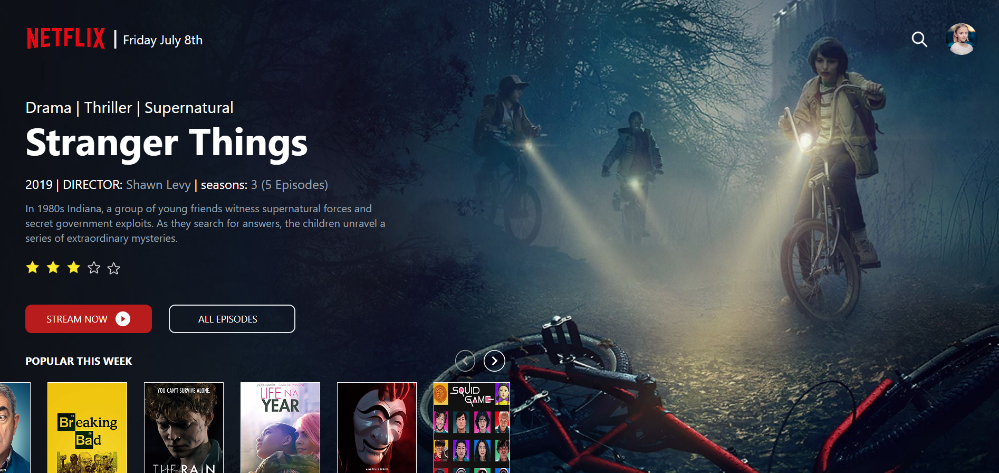

# 📺 Clone da Tela Inicial da Netflix com Tailwind CSS

Este projeto é um clone da tela inicial da Netflix, desenvolvido com o objetivo de praticar e aprender **Tailwind CSS**.  
Aqui treinei conceitos como:

- Backgrounds personalizados
- Alinhamento com `justify-*`
- Paleta de cores com Tailwind
- Responsividade
- Estruturação com Flexbox
- Espaçamentos e fontes

---

## 🖼️ Preview

> 

---

## 🚀 Tecnologias

- HTML5
- Tailwind CSS

